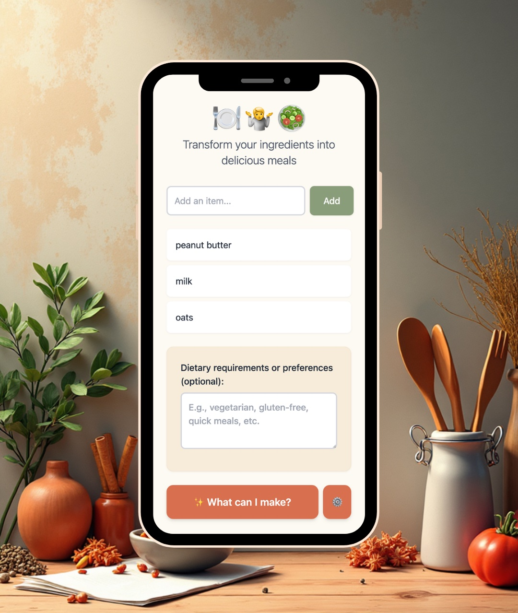

# 🍽 🤷 🥗 What to Cook?!

A Next.js application that helps you discover recipes based on ingredients you have in your fridge and pantry. Powered by Groq's AI to generate creative recipe suggestions tailored to your available ingredients and dietary requirements.

Now with **user authentication** and **cloud storage** - save your fridge across devices!



## Features

### Core Features
- **Ingredient Management**: Add, edit, and remove ingredients with an intuitive interface
- **AI-Powered Recipes**: Get recipe suggestions using Groq's LLaMA 3.3 70B model
- **Custom Requirements**: Specify dietary restrictions, cuisine preferences, or other requirements
- **Progressive Web App**: Install the app on your mobile device or desktop for an app-like experience
- **Offline Support**: Service worker caches app resources for offline functionality
- **Clean Architecture**: Well-organized component structure for maintainability and reusability

### NEW: Multi-User Features 🎉
- **Passwordless Authentication**: Sign in with magic links sent to your email - no password needed!
- **Cloud Storage**: Save your fridge items, dietary requirements, and API key securely in the cloud
- **Cross-Device Sync**: Access your saved fridge from any device
- **Privacy First**: Your data is encrypted and private to you
- **Account Management**: Easy profile editing and account deletion
- **Works Anonymously Too**: App remains fully functional without an account

## Getting Started

### Prerequisites

- [Deno](https://deno.com) runtime installed
- A [Groq API key](https://console.groq.com/keys) (free tier available)
- **For authentication features**:
  - [Resend](https://resend.com) API key for sending magic link emails
  - Domain configured for sending emails (via Resend)

### Installation

1. Clone the repository
2. Install dependencies:

```bash
npm install
```

3. Copy `.env.example` to `.env.local` and configure:

```bash
cp .env.example .env.local
```

4. Set up your environment variables:

```env
# Optional: Default Groq API key (users can provide their own)
GROQ_API_KEY=your_groq_api_key

# Required for authentication
RESEND_API_KEY=your_resend_api_key
FROM_EMAIL=noreply@yourdomain.com
JWT_SECRET=your_random_jwt_secret
ENCRYPTION_KEY=your_random_encryption_key
```

### Configuration

#### Without an Account (Anonymous Use)
1. Click the settings icon (⚙️) in the recipe form
2. Enter your Groq API key
3. Click "Save"

Your API key is stored locally in your browser.

#### With an Account (Recommended)
1. Click "Sign In / Sign Up" in the top-right corner
2. Enter your email address
3. Check your email for the magic link
4. Click the link to sign in
5. Save your API key and dietary requirements in your profile
6. Your data is now saved in the cloud and synced across devices!

### Development

Run the development server:

```bash
deno run dev
# or
npm run dev
```

Open [http://localhost:3000](http://localhost:3000) to see the application.

### Production Build

Build the application for production:

```bash
npm run build
npm run start
```

## How It Works

1. **Add Ingredients**: Enter items from your fridge and pantry
2. **Set Requirements** (optional): Specify dietary needs, cuisine type, cooking time, etc.
3. **Sign In** (optional): Create an account to save your fridge to the cloud
4. **Generate Recipes**: Click "Get Recipes" to receive AI-generated suggestions
5. **Get Inspired**: View 3 simple recipe ideas with descriptions

## Technology Stack

- **Framework**: Next.js 15 with React 19
- **Runtime**: Deno (with Node.js compatibility)
- **Styling**: Tailwind CSS
- **AI Provider**: Groq (LLaMA 3.3 70B Versatile)
- **Language**: TypeScript
- **PWA**: next-pwa for Progressive Web App functionality
- **Database**: Deno KV for user data and sessions
- **Authentication**: Magic link (passwordless) via Resend
- **Encryption**: Web Crypto API for secure API key storage

## Authentication & Security

### How Magic Links Work
1. User enters their email address
2. Server generates a secure one-time token
3. Email with magic link is sent to the user
4. User clicks the link (valid for 15 minutes)
5. Server verifies token and creates a session
6. User is logged in with a secure session cookie

### Security Features
- **Rate Limiting**: Prevents abuse of authentication and API endpoints
- **Encrypted Storage**: User API keys are encrypted using AES-GCM
- **Secure Sessions**: JWT-based sessions with httpOnly cookies
- **One-Time Tokens**: Magic links expire after 15 minutes and can only be used once
- **CSRF Protection**: Session cookies use SameSite=Lax
- **No Passwords**: Eliminates password-related security risks

### Privacy
- Your data is private and only accessible by you
- API keys are encrypted at rest
- You can delete your account and all data at any time
- The app works fully anonymously if you choose not to sign in

## Installing as PWA

### On Mobile (iOS/Android)

**iOS (Safari):**

1. Open the app in Safari
2. Tap the Share button (square with arrow)
3. Scroll down and tap "Add to Home Screen"
4. Tap "Add" to confirm

**Android (Chrome):**

1. Open the app in Chrome
2. Tap the menu (three dots)
3. Tap "Add to Home Screen" or "Install App"
4. Tap "Add" to confirm

### On Desktop

**Chrome/Edge:**

1. Open the app
2. Look for the install icon (+) in the address bar
3. Click "Install"

**Desktop PWA features:**

- Runs in its own window
- Appears in your application menu
- Works offline with cached content

## Project Structure

See [ARCHITECTURE.md](./ARCHITECTURE.md) for detailed information about the component architecture and design patterns used in this project.

## PWA Documentation

For information about the Progressive Web App features and how to install the app on your device:

- See [PWA.md](./PWA.md) for comprehensive PWA documentation including:
  - Installation instructions for mobile and desktop
  - Service worker configuration
  - Caching strategies
  - Offline functionality
  - Troubleshooting guide

## API Documentation

For developers integrating with the API or wanting to understand the API capabilities:

- See [API.md](./API.md) for comprehensive API documentation including:
  - Authentication and rate limiting
  - Request/response formats
  - Error handling and codes
  - Validation rules
  - Security features
  - Code examples

## Deploy on Deno

Deploy this application to Deno Deploy:

1. Go to the [Deno Deploy dashboard](https://app.deno.com/)
2. Click "New Project"
3. Connect your GitHub repository
4. Deploy!

## License

This project is open source and available under the MIT License.
